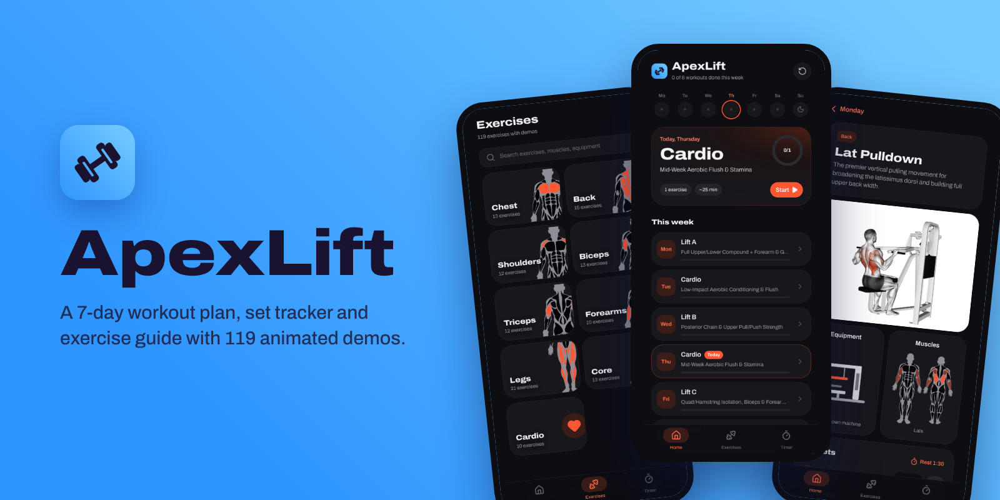
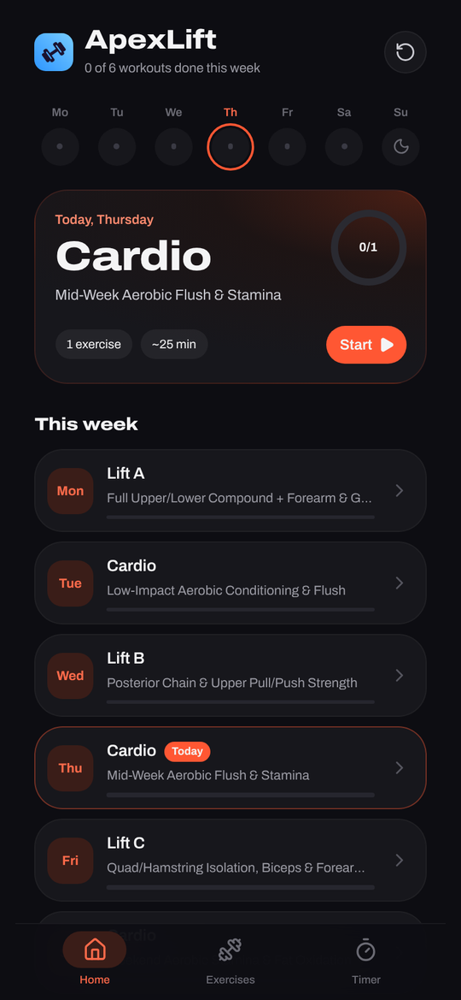
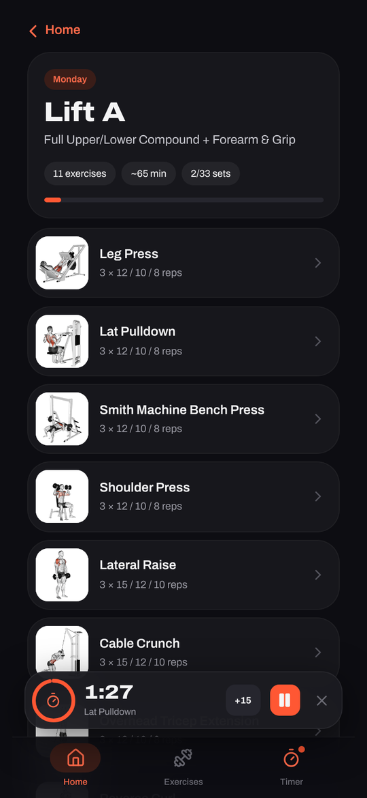
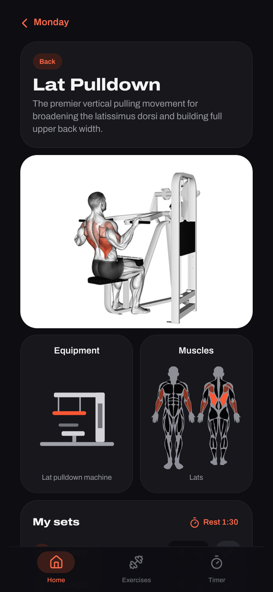
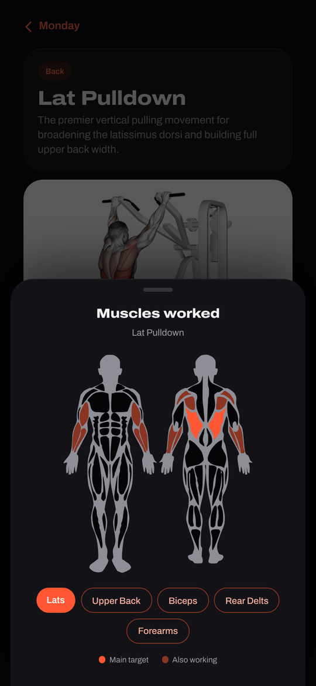
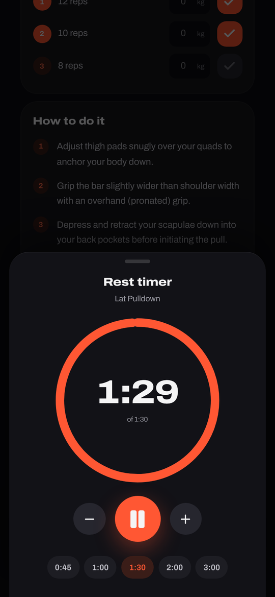
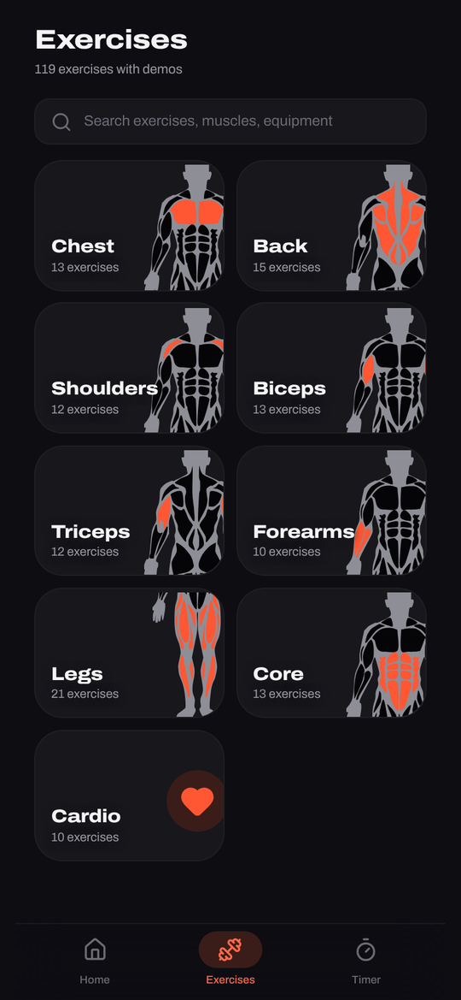
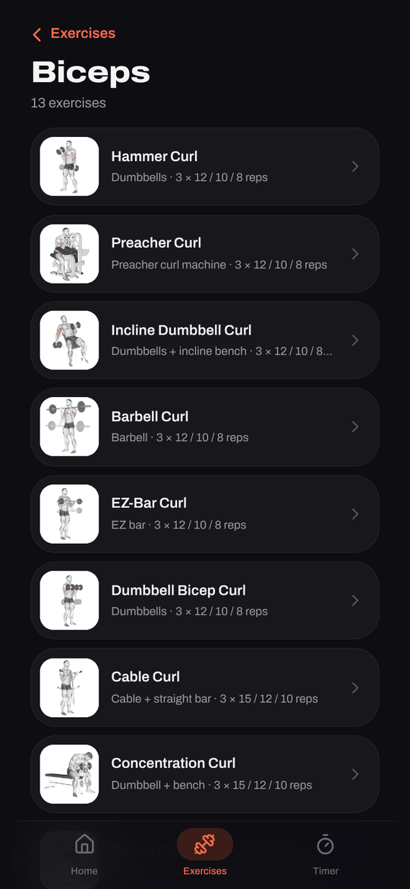
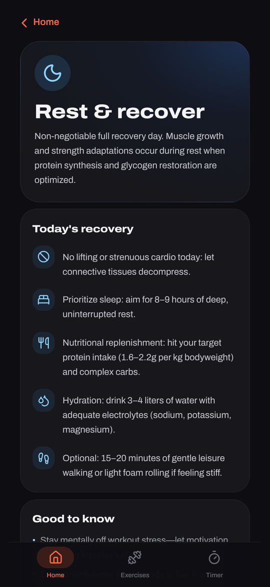
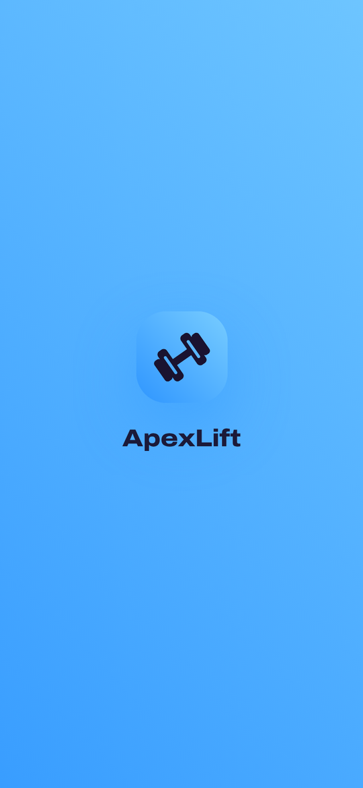

<p align="center">
  
</p>

# ApexLift

A workout app for Android: a 7-day training plan, a set and weight tracker, a rest timer, and a library of 119 exercises, each with an animated demo, step-by-step form guide and a muscle map.

## Screenshots

<table>
  <tr>
    <td align="center"><br><sub>Home: this week at a glance</sub></td>
    <td align="center"><br><sub>A workout day</sub></td>
    <td align="center"><br><sub>Exercise with animated demo</sub></td>
  </tr>
  <tr>
    <td align="center"><br><sub>Muscles worked</sub></td>
    <td align="center"><br><sub>Rest timer</sub></td>
    <td align="center"><br><sub>Exercise library</sub></td>
  </tr>
  <tr>
    <td align="center"><br><sub>Exercises by muscle group</sub></td>
    <td align="center"><br><sub>Rest day</sub></td>
    <td align="center"><br><sub>Opening animation</sub></td>
  </tr>
</table>

## Features

- **7-day plan:** three lifting days, three cardio days and a rest day, with today highlighted.
- **Set tracker:** tick off sets, log the weight for each one, and see your progress for the day and the week.
- **Rest timer:** starts automatically when you finish a set, keeps the right time even when your phone locks, and lets you add or remove 15 seconds.
- **119 exercises:** chest, back, shoulders, biceps, triceps, forearms, legs, core and cardio, each with an animated demo, how-to steps, form tips and common mistakes.
- **Muscle map:** shows the main muscles an exercise works in bright orange and the helper muscles in dim orange.
- **Works offline:** all demos and data are built into the app.

## Build it yourself

Built with React, Vite, Tailwind CSS and Capacitor.

```bash
npm install
npm run build
npx cap sync android
```

Every push to `main` builds a debug APK with GitHub Actions. Download it from the run's **Artifacts** section in the **Actions** tab.

## Credits

Exercise animations come from [omercotkd/exercises-gifs](https://github.com/omercotkd/exercises-gifs) (MIT licence).
